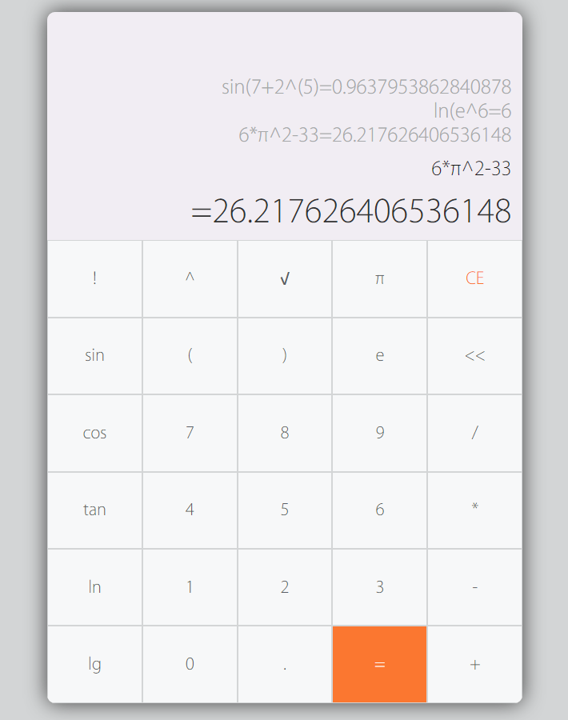

## Calculator

> 

## [Github地址](https://github.com/HeskeyBaozi/web-homework-sysu/tree/5-Calc)
develop building
```bash
$ npm install
$ webpack -p
```

## 目录

```
src
+--myModel // 简单实现的类MVVM小框架
|     +--observer // 观察者模式
|     |      +--dep.js // 数据依赖
|     |      +--index.js
|     |      `--watcher.js // 数据一更新立刻调用回调
|     `--index.js
|
+--normalize // 规格化表达式与计算器
|       +--expression.js
|       `--style.js
|
+--helper.js // 显示计算结果的帮助函数
+--index.js
+--myQuery.js // 简单实现的类似jQuery小库 封装了事件处理
+--parser.js // 表达式解析
+--types.js // 指令解析
`--util.js // 工具函数
```